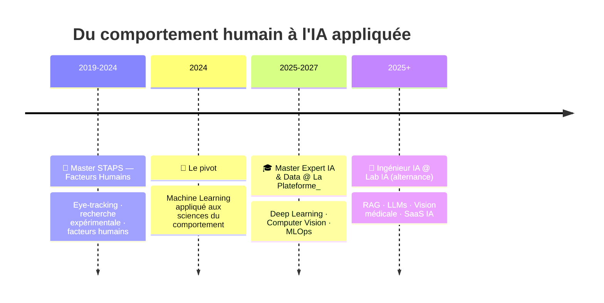

<div align="center">

# 🧠 Romuald Courtois
### *De l'humain à l'IA — quand les sciences cognitives rencontrent le Machine Learning*


[](https://github.com/Hierogifle)
[](https://linkedin.com/in/romuald-courtois-b71945231/)
[](mailto:romuald.courtois@proton.me)

</div>

---

## 🎯 En une phrase

Ingénieur IA au **Lab IA de [La Plateforme_](https://laplateforme.io)**, je conçois des systèmes intelligents — **RAG, computer vision, modélisation comportementale** — pour des problématiques où **l'humain est au centre**.

Mon atout : un double background **STAPS – Facteurs Humains × Machine Learning** qui me permet de construire des IA qui ne sont pas seulement performantes, mais qui ont du *sens* pour ceux qui les utilisent.

---

## 🛤️ Mon parcours : du terrain au code



---

## 🔭 Actuellement dans mon lab…

```python
class RomualdAI:
    def __init__(self):
        self.role        = "Ingénieur IA @ Lab IA — La Plateforme_"
        self.current     = ["🎗️ Ruban Rose", "🌌 Astrolabe / Nebula", "🤖 RAG Teams Bot"]
        self.learning    = ["Agents IA", "Fine-tuning LLMs", "MLOps avancé"]
        self.hot_stack   = ["PyTorch", "Ollama", "Docker", "RAG pipelines"]
        self.obsession   = "Prédire l'intention humaine via l'eye-tracking"

    def method(self):
        return "Hypothèse → Données → Modèle → Validation → Déploiement"

    def superpower(self):
        return "Lire un problème technique avec les yeux d'un chercheur en facteurs humains"
```

---

## 🛠️ Stack Technique

### 💻 Langages & Environnements


### 🧠 Deep Learning & Computer Vision


### 🚀 LLMs & IA Générative


### 📊 Data Science & Analyse


### 📈 Visualisation


### 🐳 DevOps & Infrastructure


### 🌐 Web, API & Déploiement


### 🧩 Architectures & Modèles

<table>
<tr>
<td width="25%" align="center">

#### 🔮 Neural Nets
`MLP` · `CNN`
`Transformers`

</td>
<td width="25%" align="center">

#### 🌳 Tree-Based
`XGBoost`
`LightGBM`
`Random Forest`

</td>
<td width="25%" align="center">

#### 📉 Dim. Reduction
`PCA` · `MCA` · `FAMD`
`t-SNE` · `UMAP`
`PaCMAP`

</td>
<td width="25%" align="center">

#### ⚙️ Optimisation
`Optuna`
`Focal Loss`
`Grid Search`

</td>
</tr>
</table>

---

## 📊 GitHub en chiffres

<div align="center">


</div>

---

## 🧪 Projets

### 🎗️ Ruban Rose — Classification d'images médicales
*Vision par ordinateur appliquée au cancer du sein (dataset BreakHis)*

Pipeline de deep learning pour la classification histopathologique **Benign / Malignant**.
Gestion fine des splits train/test (zéro fuite patient), **Focal Loss** pour déséquilibre de classes, visualisation claire pour diagnostic humain.

`PyTorch` · `CNN` · `Focal Loss` · `Computer Vision médicale`

---

### 🌌 Astrolabe / Nebula — SaaS Job Intelligence
*Plateforme IA d'analyse du marché de l'emploi*

Développement d'un SaaS en phase early-stage combinant **scraping, enrichissement LLM et dashboard d'insights** pour décoder les tendances du marché de l'emploi tech.

`LLMs` · `Scraping` · `Data pipelines` · `SaaS architecture`

---

### 🤖 RAG Teams Bot — Assistant conversationnel en entreprise
*Chatbot RAG intégré à Microsoft Teams*

Bot conversationnel basé sur un pipeline **RAG** avec LLM local (Ollama), optimisé pour les contraintes UX d'une interface enterprise (latence, progressive disclosure, animations de chargement).

`RAG` · `Ollama` · `Qwen` · `UX conversationnelle`

---

### 🎮 RiseInGame — Analyse esport via eye-tracking
*Plateforme d'entraînement cognitif pour joueurs esport*

Capture des patterns visuels en situation de jeu, détection de **zones d'attention et de fatigue cognitive**, feedback adaptatif pour optimisation des performances.

`Eye-tracking` · `Computer Vision` · `Real-time` · `Performance analysis`

---

### 📚 L'Odyssée de l'Intelligence Artificielle *(en cours)*
*Ouvrage de vulgarisation sur l'histoire de l'IA*

Synthèse historique et technique retraçant l'évolution de l'IA, de Turing aux transformers modernes. Accessible, rigoureux, narratif.

`Vulgarisation` · `Histoire des sciences` · `IA générative`

---

### 🌊 Terre-Vent-Feu-Eau-Data — Prédiction des feux de forêt
*Data science géospatiale appliquée à la prévention des incendies*

Projet collaboratif combinant **analyses géospatiales, features météo et modélisation prédictive**, avec dashboard interactif.

`Python` · `Plotly` · `scikit-learn` · `Geospatial ML`

---

## 🎯 Vision & Ambition

> *"Construire une IA qui décode le comportement humain — pour améliorer performance, bien-être et qualité des décisions."*

**🎯 Axes de recherche :**
- Modélisation prédictive des intentions via eye-tracking
- Computer Vision appliquée au sport, à l'esport et à la santé
- Systèmes adaptatifs **human-centered**

**🚀 Objectif long terme :** Carrière **R&D** à l'intersection de l'IA, des sciences cognitives et de l'analyse de performance humaine — dans le sport, la santé, l'aéronautique ou la défense.

---

## 🏃 Hors du lab

| | | |
|:-:|:-:|:-:|
| ⚽ **Football** <br> *lecture tactique* | 🏐 **Volley-ball** <br> *coordination collective* | ⛰️ **Trail running** <br> *endurance mentale* |
| 🎮 **Gaming** <br> *sujet de recherche ET passion* | 👨‍🍳 **Cuisine** <br> *expérimentation (résultats variables)* | 📖 **Lecture** <br> *IA, sciences, philo* |

---

<div align="center">

### 🤝 On collabore ?

**IA appliquée au sport ?** · **Eye-tracking ?** · **Projet R&D ?** · **Juste discuter ?**

[](https://linkedin.com/in/romuald-courtois-b71945231/)
[](https://github.com/Hierogifle)
[](mailto:romuald.courtois@proton.me)

---


*« L'IA la plus sophistiquée reste l'intelligence humaine… pour l'instant 😉 »*

</div>
