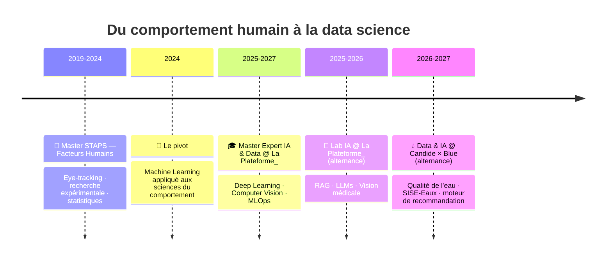

<div align="center">

# 🧠 Romuald Courtois
### *De l'humain à l'IA — quand les sciences cognitives rencontrent le Machine Learning*


[](https://linkedin.com/in/romuald-courtois-b71945231/)
[](mailto:romuald.courtois@proton.me)
[](https://terre-vent-feu-eau-data.streamlit.app)

</div>

---

## 🎯 En une phrase

**Alternant Data & IA chez Candide × Blue** — une alternative domestique à l'eau en bouteille, pilotée par la qualité de l'eau locale — et en **M2 Expert IA & Data à [La Plateforme_](https://laplateforme.io)**, je construis des modèles dont on peut **vérifier les résultats** : protocole avant le code, validation sans fuite, incertitude chiffrée.

Mon atout : un background de chercheur en **STAPS – Facteurs Humains** (eye-tracking, modélisation du comportement). La démarche scientifique — hypothèse, biais, validation — appliquée au Machine Learning.

---

## 🛤️ Parcours


```mermaid
timeline
    title Du comportement humain à la data science
    2019-2024 : 🏃 Master STAPS — Facteurs Humains
              : Eye-tracking · recherche expérimentale · statistiques
    2024      : 🔄 Le pivot
              : Machine Learning appliqué aux sciences du comportement
    2025-2027 : 🎓 Master Expert IA & Data @ La Plateforme_
              : Deep Learning · Computer Vision · MLOps
    2025-2026 : 🤖 Lab IA @ La Plateforme_ (alternance)
              : RAG · LLMs · Vision médicale
    2026-2027 : 💧 Data & IA @ Candide × Blue (alternance)
              : Qualité de l'eau · SISE-Eaux · moteur de recommandation
```

---

## 🔭 En ce moment

```python
class Romuald:
    role     = "Alternant Data & IA @ Candide × Blue"
    school   = "M2 Expert IA & Data @ La Plateforme_"
    shipping = ["💧 Qualité de l'eau à l'adresse", "🔥 Terre-Vent-Feu-Eau-Data"]
    learning = ["Séries temporelles", "Statistiques bayésiennes", "MLOps"]
    method   = "Hypothèse → Données → Modèle → Validation → Déploiement"
    rule     = "Une métrique trop belle est une fuite jusqu'à preuve du contraire"
```

---

## 💧 Chez Candide × Blue

*Une station d'affinage de l'eau du robinet (filtration + pétillance) et des minéraux fonctionnels en sticks, recommandés à partir de la qualité de l'eau du foyer.*

Je porte le **volet data & IA** de l'entreprise. Le cœur : **croiser la qualité de l'eau à l'adresse avec le profil du foyer** pour recommander la bonne cartouche filtrante et le bon profil de reminéralisation.

<table>
<tr>
<td width="50%" valign="top">

**✅ Fait**
- Acquisition et structuration des données du contrôle sanitaire **SISE-Eaux** (~7 Go) et des contours des réseaux de distribution
- **18 notebooks d'analyse** de la qualité de l'eau du robinet en France, restitués à la direction
- Audit chiffré d'un POC de base de données livré par un prestataire
- **Explorateur eau** : outil web interne d'exploration des données

</td>
<td width="50%" valign="top">

**🛠️ En cours / à venir**
- Chaînage **adresse → UDI → derniers résultats d'analyse**, socle du moteur de recommandation
- Modélisation de la qualité de l'eau par territoire : nitrates, pesticides et métabolites, **PFAS**
- Extension à l'Europe et classement des pays par disponibilité des données
- Télémétrie de la station, indicateurs d'impact, outils IA internes et charte IA

</td>
</tr>
</table>

`SISE-Eaux` · `Hub'Eau` · `Géodonnées` · `SQL` · `Python` · `Recommandation`

---

## ⭐ Projet phare

### 🔥 [Terre, Vent, Feu, Eau, Data](https://github.com/Hierogifle/terre-vent-feu-eau-data) — risque de feu de forêt, commune × jour

[](https://terre-vent-feu-eau-data.streamlit.app)
[](https://hierogifle.github.io/terre-vent-feu-eau-data/)
[](https://github.com/Hierogifle/terre-vent-feu-eau-data/actions/workflows/ci.yml)

*Quel est le risque de feu de la commune X le jour J ?* Quatre sources publiques (Copernicus CEMS, BDIFF, CORINE, INSEE) croisées dans PostgreSQL/PostGIS, une grille de **253 M lignes** (2006-2025) et un événement à **0,019 %** de positifs.

<table>
<tr>
<td width="55%">

<a href="https://terre-vent-feu-eau-data.streamlit.app"></a>

</td>
<td width="45%">

- **Barrière temporelle** train 2006-19 / val 2020-22 / test 2023-25, garde-fous anti-fuite testés
- **5 modèles** comparés avec IC appariés — XGBoost, RF, DART, MLP, LSTM
- **×63,7 le hasard** sur le test, mesuré une seule fois
- **Explicabilité** : SHAP local, LIME, contrefactuels DiCE
- **Séries temporelles** : ADF, SARIMAX, tendance sur 53 ans de météo
- **Projections 2100** sous 3 scénarios GIEC
- Sans `lat`/`lon`, le modèle retrouve seul les Landes, la Méditerranée et la Corse

</td>
</tr>
</table>

`PostgreSQL/PostGIS` · `XGBoost` · `PyTorch` · `SHAP` · `statsmodels` · `Streamlit` · `pytest` · `GitHub Actions`

---

## 🧪 Autres projets

| Projet | Ce que ça fait | Stack |
|---|---|---|
| 🎬 [**Sparkle Movie**](https://github.com/Hierogifle/sparkle-movie) | Recommandation sur 87 000+ films : *« Fait pour vous »* (KNN + cosinus TF-IDF) et *« Changer d'air »* (hors de ses genres habituels) | `FastAPI` `scikit-learn` `React 19` `Docker` |
| ✍️ [**Handwritten Digits**](https://github.com/Hierogifle/Handwritten_Digits_Classification) | App web MNIST : dessin, upload ou caméra, prédictions MLP et CNN comparées en direct | `PyTorch` `Flask` `Canvas` `WebRTC` |
| 🎓 [**DropOutGuard**](https://github.com/Hierogifle/DropOutGuard) | Détection précoce du décrochage étudiant : AFDM sur données mixtes + MLP, dont un MLP NumPy from scratch | `PyTorch` `NumPy` `FAMD` |
| 🧩 [**ANN Playground**](https://github.com/Hierogifle/ANN-playground) · [**Perceptron**](https://github.com/Hierogifle/building-perceptron) | Fondamentaux : perceptron puis MLP codés à la main, comparés à Keras | `NumPy` `Keras` |
| 📚 [**L'Odyssée de l'IA**](https://github.com/Hierogifle/ai-odyssey) | Recueil documentaire sur l'histoire de l'IA, de la logique aux transformers, avec timeline interactive | `LaTeX` `HTML` |

<details>
<summary><b>🤖 Lab IA — La Plateforme_ (2025-2026)</b></summary>
<br>

- **RAG Teams Bot** — assistant RAG avec LLM local (Ollama / Qwen) intégré à Microsoft Teams, pensé pour les contraintes UX enterprise (latence, progressive disclosure)
- **Astrolabe / Nebula** — SaaS d'analyse du marché de l'emploi : scraping, enrichissement LLM, dashboard d'insights
- **Ruban Rose** — classification histopathologique Benign / Malignant (BreakHis), split sans fuite patient, Focal Loss

</details>

---

## 🛠️ Stack technique

### 💻 Langages


### 📊 Data Science & ML


### 🧠 Deep Learning & Computer Vision


### 🚀 LLMs & IA générative


### 🗄️ Données & géospatial


### 📈 Visualisation


### 🌐 Apps & API


### 🐳 DevOps & qualité


### 🧩 Modèles & méthodes

<table>
<tr>
<td width="25%" align="center" valign="top">

#### 🔮 Neural Nets
`MLP` · `CNN`
`LSTM` · `Transformers`

</td>
<td width="25%" align="center" valign="top">

#### 🌳 Tree-Based
`XGBoost` · `DART`
`LightGBM`
`Random Forest`

</td>
<td width="25%" align="center" valign="top">

#### ⏱️ Séries temporelles
`SARIMAX`
`ACF` · `PACF` · `ADF`

</td>
<td width="25%" align="center" valign="top">

#### 📉 Réduction de dim.
`PCA` · `MCA` · `FAMD`
`t-SNE` · `UMAP`
`PaCMAP`

</td>
</tr>
<tr>
<td width="25%" align="center" valign="top">

#### 🔍 Explicabilité
`SHAP` · `LIME`
`DiCE` (contrefactuels)

</td>
<td width="25%" align="center" valign="top">

#### ✅ Évaluation
`Calibration`
`IC appariés`
`Split temporel / par groupe`

</td>
<td width="25%" align="center" valign="top">

#### ⚙️ Optimisation
`Optuna` · `Grid Search`
`Focal Loss`
`Rééchantillonnage`

</td>
<td width="25%" align="center" valign="top">

#### 💬 NLP & Reco
`RAG` · `TF-IDF`
`KNN` · `Cosine sim.`

</td>
</tr>
</table>

---

## 🎯 Vision

> *"Construire une IA qui décode le comportement humain — pour améliorer performance, santé et qualité des décisions."*

- Modélisation prédictive des intentions via **eye-tracking**
- IA appliquée au **sport, à l'esport et à la santé**
- Systèmes adaptatifs **human-centered**, évalués avec la rigueur d'un protocole expérimental

**Objectif long terme :** une carrière **R&D** à l'intersection de l'IA, des sciences cognitives et de la performance humaine.

---

## 🏃 Hors du code

| ⚽ **Football** <br> *lecture tactique* | 🏐 **Volley-ball** <br> *coordination collective* | ⛰️ **Trail running** <br> *endurance mentale* |
| 🎮 **Gaming** <br> *sujet de recherche ET passion* | 👨‍🍳 **Cuisine** <br> *expérimentation (résultats variables)* | 📖 **Lecture** <br> *IA, sciences, philo* |

---

<div align="center">

### 🤝 On en parle ?

**Data de l'eau ?** · **Data science appliquée à la santé ?** · **Eye-tracking ?** · **Projet R&D ?** · **Juste discuter ?**

[](https://linkedin.com/in/romuald-courtois-b71945231/)
[](mailto:romuald.courtois@proton.me)


*« L'IA la plus sophistiquée reste l'intelligence humaine… pour l'instant 😉 »*

</div>
